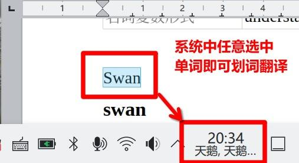

# Swan Dict 天鹅词典

<p align="center">
  
</p>

Swan Dict 是一个 KDE Plasma 6 小组件，基于系统自带的 Digital Clock 改造。在系统中的任意应用选中单词即可触发划词翻译。翻译内容会取代桌面的日期部分，减少桌面空间的占用。

<p align="center">
  
</p>

将鼠标悬停在小组件上方或点击小组件可以获得更详尽的翻译。

https://github.com/user-attachments/assets/03ee851b-52c1-4550-bb38-dbdf94e013e0

它会读取当前 primary selection：

- 在紧凑视图中，用选中文本的简短释义替换原本的日期文本。
- 在小组件上方悬停时显示本地词典释义。
- 点击时打开词典弹窗，显示完整释义、变形表、复制按钮等。
- 多词选中时，按单词拆分并分别显示词典内容。

## 功能

- 与 KDE Plasma 桌面深度集成，在几乎任意界面下都能触发划词翻译。
- 使用本地 SQLite 词典，不依赖网络完成单词翻译。
- 使用原生语言编写，无 WebView 常驻后台，轻量且快速。
- Wayland 原生支持。
- （可选）支持 DeepSeek 手动整句翻译。

## 安装

当前项目已经准备了 Open Build Service 打包配置，目标包括：

- Debian 13
- Fedora 44
- Arch Linux

请前往 [Open Build Service](https://software.opensuse.org/download.html?project=home%3Alxyan3&package=swan-dict) 选择您对应的发行版进行安装。页面上有详细的安装步骤指引。

Open Build Service 的 Ubuntu 支持仍未完善，Ubuntu 用户可前往 [Github Action](https://github.com/LXYan2333/swan-dict/actions) 下载最新构建的软件包

安装完成后，请右键单击系统原有时钟，在弹出菜单里选择`显示替代部件`


在弹出菜单中选择`天鹅词典`


即可完成安装。

- 为什么不使用 KDE 自带的桌面小部件商店分发？
  - KDE 自带的桌面小部件商店在国内访问困难
  - 为了访问系统的 primary selection，本项目有`C++`二进制代码，[无法使用KDE自带的商店分发](https://develop.kde.org/docs/plasma/widget/c-api/)
- 为什么需要系统级安装？
  - 一般的桌面小部件可以安装到用户家目录，无需系统级安装
  - 但是为了与`QML`编写的桌面小部件集成，本项目的`C++`二进制代码编译成了一个`QML`模块。为了让 KDE 能找到这个模块，我们必须将它放在`QML`的系统级默认导入目录
  - 如果设置`QML2_IMPORT_PATH`环境变量到我们的`QML`模块位置，可以实现在用户目录下安装，但是这需要用户手动修改配置文件以实现环境变量的更改，用户体验不佳

## 依赖

构建依赖大致包括：

- CMake
- Extra CMake Modules
- pkg-config / pkgconf
- C++17 编译器
- Python 3
- Qt 6 Core / Gui / Network / Qml / Sql
- KF6 I18n
- KF6 Package
- Plasma Workspace
- Wayland client 开发文件和 wayland-protocols
- KWin 开发文件，用于构建可选鼠标点击辅助 effect

运行依赖：

- Plasma 6
- Qt 6 SQLite 插件
- 可选：KWin 鼠标点击辅助 effect，用于在用户点击其它位置后更快清空过期选区翻译

Debian 13 上可参考：

```console
sudo apt --mark-auto install \
  cmake extra-cmake-modules ninja-build pkgconf python3 \
  qt6-base-dev qt6-declarative-dev qt6-tools-dev-tools \
  libkf6i18n-dev libkf6package-dev \
  plasma-workspace kwin-dev libwayland-dev wayland-protocols
```

## 初始化源码

```console
git submodule update --init --recursive
```

ECDICT 以 git submodule 形式放在：

```text
third_party/ECDICT
```

## 构建

```console
cmake -B build -S .
cmake --build build
```

CMake 会在构建时从：

```text
third_party/ECDICT/ecdict.csv
```

生成：

```text
applet/contents/data/ecdict.sqlite
```

该 SQLite 文件是生成产物，不应提交到 git。

如果只想快速测试 importer，可以使用 ECDICT 的 mini 数据：

```console
python3 tools/import-ecdict/import_ecdict.py \
  --source third_party/ECDICT/ecdict.mini.csv \
  --output applet/contents/data/ecdict.sqlite
```

## 从源码树测试

开发时通常不需要安装小组件，可以直接从源码树启动：

```console
QML2_IMPORT_PATH=build/src plasmoidviewer -a applet
```

如果修改了 C++ 代码，重新构建：

```console
cmake --build build
```

注意：这是开发测试方式，不等同于在 Plasma 面板中正式安装。
`QML2_IMPORT_PATH=build/src` 只对这条 `plasmoidviewer` 命令生效，不会自动影响
Plasma 桌面进程。

## 可选 KWin 鼠标点击辅助（默认开启）

Wayland 下 primary selection 的提供方有时不会在“视觉上取消选中”时清空 selection。
因此仅靠 primary-selection 协议有时可能会读到上一次选中的文本。

本项目提供一个可选 KWin effect helper（默认开启）：

```text
kwin-helper/
```

它在 KWin 内部监听全局鼠标按下事件，并通过 session D-Bus 发送信号给小组件。
小组件如果收不到该信号，会继续使用内置 primary-selection 读取逻辑，不影响运行。

构建辅助 effect：

```console
cmake -B build -S . -DSWAN_DICT_BUILD_KWIN_HELPER=ON
cmake --build build
sudo cmake --install build
```

安装后，将在词典启动时自动启动（可配置不自动启动），也可以通过 KWin D-Bus 加载 effect：

```console
qdbus6 org.kde.KWin /Effects loadEffect swandictmousehelper
```

### 从源码系统安装

如果不使用 OBS 包，也可以从源码构建并安装到系统：

```console
git submodule update --init --recursive
cmake -B build -S . -DCMAKE_BUILD_TYPE=RelWithDebInfo
cmake --build build
sudo cmake --install build
```

默认安装前缀由 CMake/KDE 安装目录决定。通常会安装到 `/usr/local` 下，包括：

- Plasma applet package
- 原生 QML 插件 `com.github.LXYan2333.SwanDict`
- 简体中文翻译文件
- 可选 KWin helper effect

如果你想让它像发行版包一样安装到 `/usr`，配置时指定：

```console
cmake -B build -S . \
  -DCMAKE_BUILD_TYPE=RelWithDebInfo \
  -DCMAKE_INSTALL_PREFIX=/usr
cmake --build build
sudo cmake --install build
```

安装后可以检查 QML 插件是否存在。不同发行版的库目录可能不同，例如：

```console
find /usr /usr/local -path '*com/github/LXYan2333/SwanDict*' -print
```

如果已经打开了 Plasma 桌面，但小组件列表里看不到它，可以重新登录，或重启 Plasma
shell：

```console
$ plasmashell --replace
```

## Digital Clock 同步机制

本项目不从系统已安装的小组件目录复制 Digital Clock QML。维护流程分两步：

```console
SWAN_DICT_PROFILE=debian/13 python3 scripts/manage.py prepare-source
SWAN_DICT_PROFILE=debian/13 SWAN_DICT_SYNC_DIGITAL_CLOCK_OVERWRITE=1 \
python3 scripts/manage.py sync-digital-clock
```

`prepare-source` 会使用当前 profile 对应发行版的 `plasma-workspace` 源码包。
如果发行版没有可用源码包，脚本会停止并提示原因，不会回退到系统安装目录。
源码缓存路径包含发行版和版本，例如：

```text
.cache/plasma-workspace-source/debian/13/source
```

这样做是为了让本项目复制目标发行版自己的 Digital Clock QML，从而尽量匹配：

```qml
import org.kde.plasma.private.digitalclock
```

## 补丁工作流

上游 Digital Clock 生成文件不直接作为 canonical source。

对这些文件的修改保存为补丁：

```text
patches/0001-digital-clock-qml-date-label.patch
patches/0002-tooltip-qml-dictionary-content.patch
patches/0003-main-qml-swan-dict-wiring.patch
patches/0005-main-xml-translation-settings.patch
```

修改以下生成文件后，需要重新生成补丁：

```console
python3 scripts/manage.py regenerate-patches
```

项目自有 QML 文件直接提交，不需要生成补丁：

```text
applets/common/contents/ui/DictionaryPopup.qml
applets/common/contents/ui/configTranslation.qml
applets/common/contents/config/config.qml
```

## 配置项

小组件配置中新增了 Translation 页面：

- Dictionary selection limit：本地词典处理选区的长度上限，默认 `128`。
- Date replacement length：紧凑视图日期替换文本长度，默认 `10`。
- KWin mouse helper：启动小组件时尝试加载可选 KWin 鼠标点击辅助 effect，默认开启。
- Sentence translation：是否允许 DeepSeek 整句翻译。
- DeepSeek API key：DeepSeek API key。

DeepSeek 翻译只会在点击弹窗中通过按钮手动触发。

它不会在悬停时自动调用，也不会在弹窗打开时自动调用。

## 国际化

KDE 翻译提取脚本：

```text
Messages.sh
```

简体中文翻译文件：

```text
po/zh_CN/plasma_applet_com.github.LXYan2333.swan-dict.po
```

## OBS 打包

OBS 相关说明见：

```text
packaging/obs/README.md
```

推荐策略：

- 先用目标发行版自己的 `plasma-workspace` 源码包生成 Digital Clock QML。
- 构建时使用已经生成好的 profile applet 文件。
- 构建时从 `third_party/ECDICT/ecdict.csv` 生成 SQLite 数据库。
- source package 不包含 `build/` 和 `applets/*/*/contents/data/ecdict.sqlite`。

## 许可证

小组件代码遵循 GPL-2.0-or-later。

ECDICT 数据遵循其上游项目许可证。
